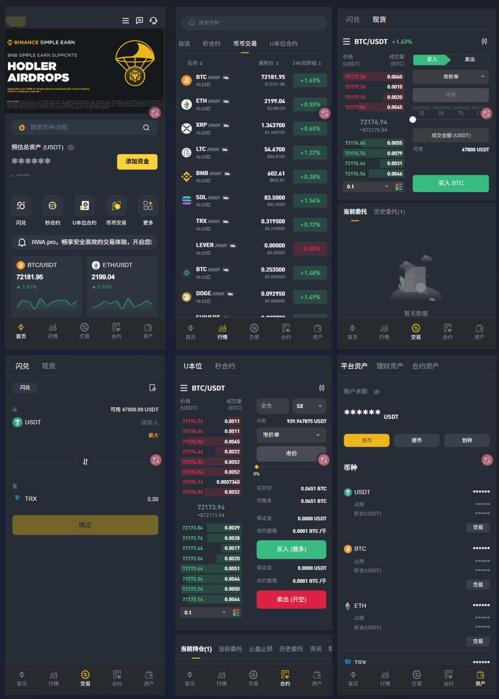
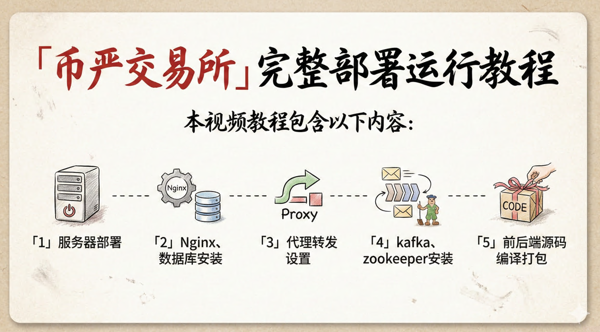

# 区块链数字交易所 合约交易所 bizzan币严

# 2026年4月份交易所重构大升级，升级日志

## 一、一期处理列表

- [ ] 登录与账户接管链路修复：钱包地址登录必须增加 challenge 签名校验，禁止“仅凭地址登录”。
- [ ] 对象级授权（IDOR/BOLA）加固：仓位、止盈止损、银行卡、后台审核/调账/KYC 等接口统一增加“资源归属校验 + 角色范围校验”。
- [ ] 后台高危越权封堵：充值/提现审核、调账、改密、拉黑、代理归属等操作增加强校验（团队边界、审批链、不可越权）。
- [ ] 2FA 密钥泄露处置：下线匿名可访问二维码/密钥接口，轮换历史密钥。
- [ ] 资金回调验签强制化：充值/提现回调增加签名校验、时间窗校验、nonce 防重放，失败即拒绝。

## 二、二期处理列表

- [ ] 资金状态机幂等化：充值、提现、退款、结算、划转全链路引入幂等键与状态 CAS，避免重复入账/退款/派奖。
- [ ] 事务一致性改造：内部划转、结算、审核资金动作改为单事务或可靠补偿事务，防止中间态失衡。
- [ ] 密码与凭据治理：移除默认弱口令（如 `123456`），改密接口强制绑定当前登录主体。
- [ ] 敏感日志脱敏：禁止打印 raw body、sign、证件号、手机号、地址、密钥，接入统一脱敏中间件。
- [ ] 前端高危操作防重：提现/下单/审核/保存做前后端双重防重复（按钮锁 + 服务端幂等）。
- [ ] URL 传敏整改：敏感参数（提现、2FA、验证码、密钥等）不得通过 URL 传递。

## 三、三期处理列表

- [ ] 密钥管理体系升级：移除配置/代码中的硬编码密钥，迁移至密钥管理服务。
- [ ] XSS 治理：公告/帮助中心/站内信等富文本入口启用内容净化、输出编码与 CSP。
- [ ] SSRF 与不安全 HTTP 工具治理：目标地址白名单、禁用 trust-all SSL、补齐证书与主机名校验。
- [ ] 依赖治理与 SBOM：升级高危依赖，移除高风险 `system-scope` 本地 jar，建立组件清单。
- [ ] 稳定性优化：邀请码 `while(true)` 改为有限重试 + 兜底方案，避免高并发性能衰减。
- [ ] 环境配置隔离：防止 dev 配置串用到生产，增加启动时环境校验。

## 四、四期处理列表

- [ ] Druid 监控台公网暴露与默认口令风险是否仍存在。
- [ ] 富文本存储型 XSS 是否可稳定触发。
- [ ] SSRF/LFI/MITM 工具链是否可形成实际可利用路径。
- [ ] 依赖漏洞在当前运行路径是否可达（需可达性验证）。

# 2026新版交易所模仿币安交易所APP

# 2025币严bizzan商业版全开源版本目前已降价，提供全套部署教程，手把手。

数字货币交易所 ，区块链永续合约、秒合约交易所开源代码，基于Springboot 、vue 开发的开源数字货币交易所。

自助下单：https://www.bnbcode.com

## 商业版介绍

币币交易、永续合约、期权合约、秒合约、矿机理财（定期，定投）等。

Java后端原始代码、原生APP代码、代理商源码、超级机器人Java代码、前端vue+UNIAPP+H5源码。

提供部署教程，海外项目提供有偿技术支持。

提供腾讯云镜像文件、VMWARE 虚拟机本地java 开发环境和VUE开发环境。

## 关于支付入金

商业版默认的支付使用第三方优盾或者手动充值。

可到优盾官网https://www.uduncloud.com/ 申请开通获取apikey 等测试，优盾使用和费用细节咨询官方客服。

若需自建支付平台，支持常见协议币种和USDT ，详细联系技术：https://t.me/usdtvps666

# 商业版演示地址2024

> 测试站已关闭。

**本项目源码仅供研究、学习使用，请遵守当地法律！**

域名今年9月份到期，兄弟们记得到时候来这关注最新域名！

# 部署、操作教程

| 项目                                    | 链接                                              |
| --------------------------------------- | ------------------------------------------------- |
| 币严Bizzan平台币控盘K线操作-视频教程    | https://www.youtube.com/watch?v=5LnzDJwIAss       |
| 视频介绍                                | https://www.youtube.com/watch?v=aVVEOkefJlE&t=29s |
| 服务器搭建教程-文档，简易版，不适合新手 | 附件:文档\00_服务器部署                           |
| 新版：币严Bizzan平台币控盘K线操作-视频教程 | https://www.youtube.com/watch?v=9bkKyKrwkQQ  |

# 开源和收费

### 开源进度表`已完成`

- [x] 开源 Android 模块源码
- [x] 开源 Ios 源码
- [x] 开源管理后台源码
- [x] 开源用户前端源码
- [x] 开源代理商前端源码
- [x] 开源服务端源码币币交易版本，秒合约版本收费未开源
- [x] mysql

## 备注

#### 1、停止kill java 服务顺序

`首先停止 er_robot_normal.jar、er_market.jar`

`接着 exchange-api.jar、contract-option-api.jar、contract-second-api.jar、contract-swap-api.jar`

`最后，ucenter-api.jar、cloud.jar、exchange.jar、market.jar、agent-api.jar、admin-api.jar、wallet_udun.jar、chat.jar、otc-api.jar、kline-robot.jar`

#### 2、spark-core-2.6.0.jar 已上传

## 项目外包

我们接外包，如果你有项目想要外包，可以联系我们。

团队包含专业的项目经理、架构师、前端工程师、设计师、后端工程师、测试工程师、运维工程师，可以提供全流程的外包服务。

项目可以是商城、DAPP系统、OA 系统、物流系统、ERP 系统、CMS 系统、支付系统、IM 聊天、微信公众号、微信小程序、Web3游戏等等。

# 联系我们

1、Whatsapp: 

***‪+44 7936 866117‬***

2、Telegram

https://t.me/usdtvps666

